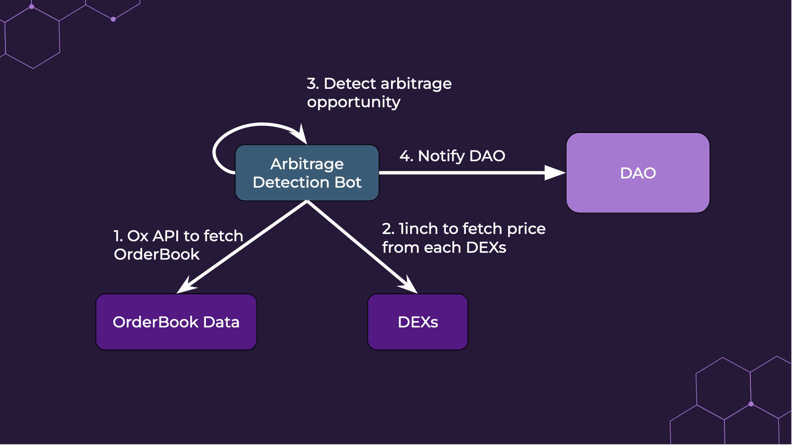
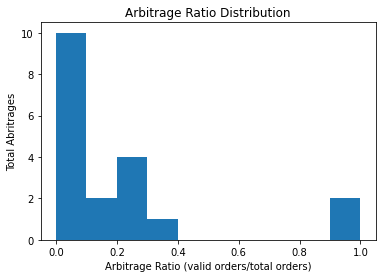

# Defi Arbitrage Bot

## Execution Steps: 
1. Determine current price of token from public order book
2. Find limit order of token on decentralized exchanges
3. Identify limit orders, to buy low and sell high (arbitrage) 

## Tools: 
Ethplorer API (Tokens), 0x API (Orderbook), 1inch API (DEX)

## Key Metrics: 
1. Latency of arbitrage
2. Successful order ratio (arbitrage order/all order)

## Expectation:
1. <60 second detection  
2. \>5% successful arbitrage orders 

## Results:
1. <5 second detection
2. 0-50% successful arbitrage orders 

## Takeaway:
1. Arbitrage opportunity varies widely based on token 

## Contributors

Xiaolei Shi, Xiaoren Yang, Surya Vengadesan